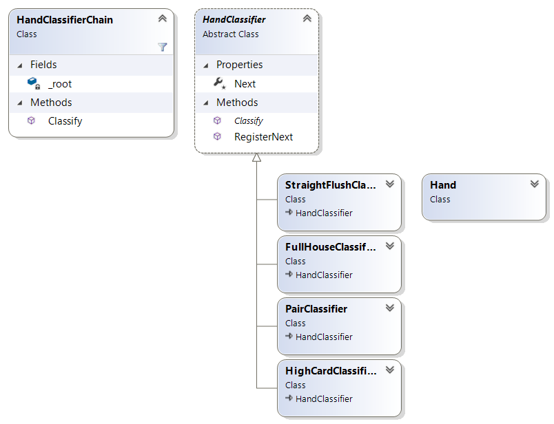

# Poker Hand

In this kata you implement the Gang Of Four Chain of Responsibility Pattern [[1](#ref-1), [2](#ref-2), [3](#ref-3)].

Origin: Coding Dojo: [Poker Hands](http://codingdojo.org/kata/PokerHands/)

## About this Kata

This kata is adopted from [Poker Hands](http://codingdojo.org/kata/PokerHands/), which is blatantly stolen from acm.uva.es/p/v103/10315.html It is a subset of KataTexasHoldEm , which is a very large Kata.

## Problem Description

Your job is use the Chain of Responsibility Pattern in to classify a poker hand [[1](#ref-1), [2](#ref-2), [3](#ref-3)].



- **HandClassifierChain** provides the `Classify` method as the entrypoint for classifying the rank of a poker hand. It delegates classifying to each member of the linked list with head `_root`.

- **HandClassifier** is the interface poker hand rank classifiers. A classifier is a dedicated class finding out whether a `Hand` has the rank the classifier represents. By using `HandClassifier.RegisterNext` you build a chain of classifiers sorted from highest rank to lowest rank.

## Poker rules description

A poker deck contains 52 cards - each card has a suit which is one of clubs, diamonds, hearts, or spades (denoted C, D, H, and S in the input data). Each card also has a value which is one of 2, 3, 4, 5, 6, 7, 8, 9, 10, jack, queen, king, ace (denoted 2, 3, 4, 5, 6, 7, 8, 9, T, J, Q, K, A). For scoring purposes, the suits are unordered while the values are ordered as given above, with 2 being the lowest and ace the highest value.

A poker hand consists of 5 cards dealt from the deck. Poker hands are ranked by the following partial order from lowest to highest.

* High Card: Hands which do not fit any higher category are ranked by the value of their highest card. If the highest cards have the same value, the hands are ranked by the next highest, and so on.
* Pair: 2 of the 5 cards in the hand have the same value. Hands which both contain a pair are ranked by the value of the cards forming the pair. If these values are the same, the hands are ranked by the values of the cards not forming the pair, in decreasing order.
* Two Pairs: The hand contains 2 different pairs. Hands which both contain 2 pairs are ranked by the value of their highest pair. Hands with the same highest pair are ranked by the value of their other pair. If these values are the same the hands are ranked by the value of the remaining card.
* Three of a Kind: Three of the cards in the hand have the same value. Hands which both contain three of a kind are ranked by the value of the 3 cards.
* Straight: Hand contains 5 cards with consecutive values. Hands which both contain a straight are ranked by their highest card.
* Flush: Hand contains 5 cards of the same suit. Hands which are both flushes are ranked using the rules for High Card.
* Full House: 3 cards of the same value, with the remaining 2 cards forming a pair. Ranked by the value of the 3 cards.
* Four of a kind: 4 cards with the same value. Ranked by the value of the 4 cards.
* Straight flush: 5 cards of the same suit with consecutive values. Ranked by the highest card in the hand.

## Suggested Test Cases

Sample input:

```
2C 3H 4S 8C AH
2H 4S 4C 2D 4H
TH JH QH KH AH
...
```

Each row of input is a game with two players. The first five cards belong to the player named “Black” and the second five cards belong to the player named “White”.

Sample output:

```
High card: Ace 
Full house: 4 over 2 
Straight flush: Ace
...
```

## Finishing Touches

- Avoid duplicated code (use `tools\dupfinder.bat`).
- Fix all static code analysis warnings.

## References

<a name="ref-1">[1]</a> David Starr and others: "Chain of Responsibility" in "Pluralsight: Design Patterns Library", https://www.pluralsight.com/courses/patterns-library, last visited on Mar 11, 2020.

<a name="ref-2">[2]</a> Erich Gamma, Richard Helm, Ralph Johnson, John Vlissides: "Design Patterns: Elements of Reusable Object-Oriented Software", Addison Wesley, 1994, pp. 151ff, [ISBN 0-201-63361-2](https://en.wikipedia.org/wiki/Special:BookSources/0-201-63361-2).

<a name="ref-3">[3]</a> Wikipedia: "Chain-of-responsibility pattern", https://en.wikipedia.org/wiki/Chain-of-responsibility_pattern, last visited on Mar. 26, 2020.
